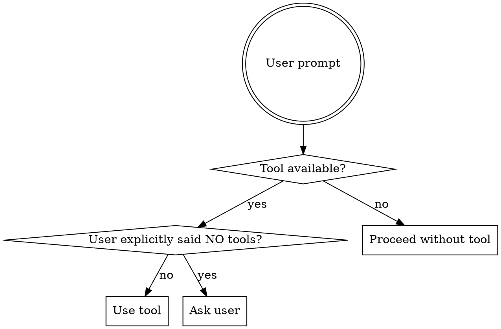

# Auto Tool Selection

## Overview

Don't wait for explicit tool requests. Analyze user prompts, identify intent, and automatically invoke matching tools or plugins.

**Core principle:** If a tool can help, use it. Don't make the user ask twice.

## When to Use

- User asks a question that matches a tool's purpose
- User describes a task that a plugin/skill can accomplish
- Available tools include relevant capabilities
- User says "find", "search", "analyze", "check", etc.

**Red flags - use a tool:**
- User wants to search → Use search tool
- User wants file analysis → Use glob/read/grep
- User wants web info → Use WebSearch/WebFetch
- User mentions installed plugins → Use those plugins
- User asks about code patterns → Use grep/glob first

## The Decision Process



## Tool Matching Patterns

### Search Intent → Search Tools

| User Says | Tool to Use |
|-----------|-------------|
| "find files with..." | `Glob` pattern |
| "search for..." | `Grep` for code, `WebSearch` for info |
| "where is X defined?" | `Grep` then `Read` |
| "look for..." | `Grep` or `Glob` |
| "check if..." | `Grep` or `Bash` |

**Example:**
```
User: "Find all test files"
→ DON'T: "I can help you find test files. Would you like me to..."
→ DO: Use Glob("**/*.test.ts") immediately
```

### Analysis Intent → Analysis Tools

| User Says | Tool to Use |
|-----------|-------------|
| "analyze this codebase" | `Agent` with explore subagent_type |
| "what does this file do?" | `Read` then explain |
| "explain the structure" | `Glob` + `Read` key files |
| "how does X work?" | `Grep` for X, `Read` definition |

**Example:**
```
User: "How does authentication work in this project?"
→ DON'T: Guess from file names
→ DO: Grep for "auth", "login", "verify" → Read relevant files → Explain
```

### Web/Documentation Intent → Web Tools

| User Says | Tool to Use |
|-----------|-------------|
| "what's the latest version of..." | `WebSearch` |
| "documentation for..." | `WebFetch` the docs URL |
| "how do I use X library?" | `WebSearch` + `WebFetch` |
| "check the website..." | `WebFetch` |

**Example:**
```
User: "What's new in React 19?"
→ DON'T: "I can search for that"
→ DO: WebSearch "React 19 new features 2025"
```

### Code Execution Intent → Execution Tools

| User Says | Tool to Use |
|-----------|-------------|
| "run the tests" | `Bash` npm test |
| "build this project" | `Bash` build command |
| "check if it compiles" | `Bash` + `Read` for build config |
| "what's the output of..." | `Bash` or `mcp__ide__executeCode` |

### Plugin/Skill Mentioned → Use Plugin

| User Says | Action |
|-----------|--------|
| "use graphify" | `Skill: graphify` |
| "/graphify this" | `Skill: graphify` |
| "analyze with graphify" | `Skill: graphify` |
| "create a skill for..." | `Skill: writing-skills` |
| mentions any plugin name | Use that plugin |

**Example:**
```
User: "/graphify the codebase"
→ DON'T: "I can help with that. First, let me..."
→ DO: Skill("graphify") immediately
```

## Automatic Tool Invocation

### DO: Invoke Without Asking

```
User: "Find all controllers in this project"
→ Glob("**/*Controller*.ts") → Present results

User: "Check the README"
→ Read("README.md") → Summarize

User: "What files are in the src directory?"
→ Bash("ls -la src/") → Present

User: "/graphify this"
→ Skill("graphify") → Execute
```

### DON'T: Ask Permission for Obvious Tools

```
❌ "Would you like me to search for that?"
❌ "I can look that up if you'd like"
❌ "Shall I check the files?"
❌ "Do you want me to use graphify?"
```

### Exception: Ask When Uncertain

```
User: "Analyze this"
→ Ambiguous: analyze what? how?
→ "I'll search for code patterns and key files. Should I also run the test suite?"

User: "Fix the bug"
→ Need more context
→ "I'll search for error patterns and recent changes. Can you share the error message?"
```

## Multi-Tool Workflows

Common tasks need multiple tools in sequence:

### Finding Code Patterns
```
1. Glob("**/*.ts") - find candidate files
2. Grep("pattern") - narrow to relevant
3. Read(file) - examine details
4. Explain findings
```

### Debugging
```
1. Grep("error pattern") - find error sources
2. Read(error location) - understand context  
3. WebSearch("error message") - find solutions
4. Edit(fix) - apply fix
5. Bash("run tests") - verify
```

### Documentation Research
```
1. WebSearch("library documentation") - find official docs
2. WebFetch(docs URL) - get details
3. Read(code) - see current usage
4. Explain integration
```

## Quick Reference

| Intent | Primary Tool | Secondary Tools |
|--------|-------------|-----------------|
| Find files | `Glob` | `Bash` for ls/find |
| Search code | `Grep` | `Read` for context |
| Read content | `Read` | `Bash` cat/head |
| Web search | `WebSearch` | `WebFetch` for details |
| Run commands | `Bash` | `Bash` with scripts |
| Explore codebase | `Agent` (explore) | `Glob` + `Grep` |
| Use skill | `Skill` | Related tools |
| Edit files | `Edit` | `Read` first |
| Create files | `Write` | - |
| Ask questions | `AskUserQuestion` | When uncertain |

## Common Mistakes

### ❌ Asking Permission for Everything
```
User: "Find test files"
Assistant: "Would you like me to search for test files using Glob?"
→ Just do it!
```

### ✅ Automatic Execution
```
User: "Find test files"
Assistant: [Glob("**/*.test.ts")] "Found 12 test files..."
```

### ❌ Manual Search When Tools Available
```
User: "Where is the auth middleware?"
Assistant: "Let me look through the files..." [manually scans]
→ Takes forever, misses things
```

### ✅ Use Grep First
```
User: "Where is the auth middleware?"
Assistant: [Grep("auth|middleware")] "Found in src/middleware/auth.ts"
```

### ❌ Ignoring Available Skills
```
User: "/graphify this codebase"
Assistant: "I can analyze the codebase structure for you..." [manual analysis]
→ Wastes time, inferior to graphify
```

### ✅ Invoke Skill Immediately
```
User: "/graphify this codebase"
Assistant: [Skill("graphify")] "Running graphify analysis..."
```

## Red Flags - Use a Tool

- User asks "find", "search", "where", "look" → Use Grep/Glob
- User asks about documentation → Use WebSearch/WebFetch
- User mentions skill name → Use Skill
- Multiple files mentioned → Use Glob
- Code patterns mentioned → Use Grep
- Web resources mentioned → Use WebFetch
- Command output needed → Use Bash
- Complex exploration → Use Agent subagent

## Edge Cases

### User Says "Don't Use Tools"
```
User: "Without using any tools, tell me what you know..."
→ Respect the constraint. Use only context + training data.
```

### User Is Unclear
```
User: "Analyze this"
→ Ambiguous. Ask: "I'll search the codebase. Any specific area to focus on?"
```

### Tool Might Fail
```
User: "Check the website"
→ WebFetch might fail. Have fallback: "I'll try to fetch it, or search if unavailable."
```

### Multiple Valid Tools
```
User: "Search for auth"
→ Could mean: code search (Grep), web search (WebSearch), or file search (Glob)
→ Start with Grep (most likely), offer WebSearch if not found
```

## Real-World Examples

| Prompt | Wrong Response | Right Response |
|--------|---------------|----------------|
| "Find controllers" | "I can help find controllers" | [Glob] "Found 8 controllers..." |
| "What's in README?" | "Let me check" | [Read] "README contains..." |
| "How does auth work?" | Guess from file names | [Grep+Read] Explain based on code |
| "/graphify this" | Explain graphify | [Skill] Execute graphify |
| "Latest React version?" | Training data cutoff | [WebSearch] Current version |

## Tool Selection Priority

When multiple tools could work:

1. **Skills first** - If user mentions skill name, use it
2. **MCP plugins** - If user mentions plugin, use it
3. **Built-in search** - Grep/Glob for code, WebSearch for web
4. **File operations** - Read/Edit/Write for file tasks
5. **Execution** - Bash for commands, Agent for complex tasks
6. **Ask** - Only when truly ambiguous

**Bottom line:** Match user intent to tool capability. Act, don't ask.
