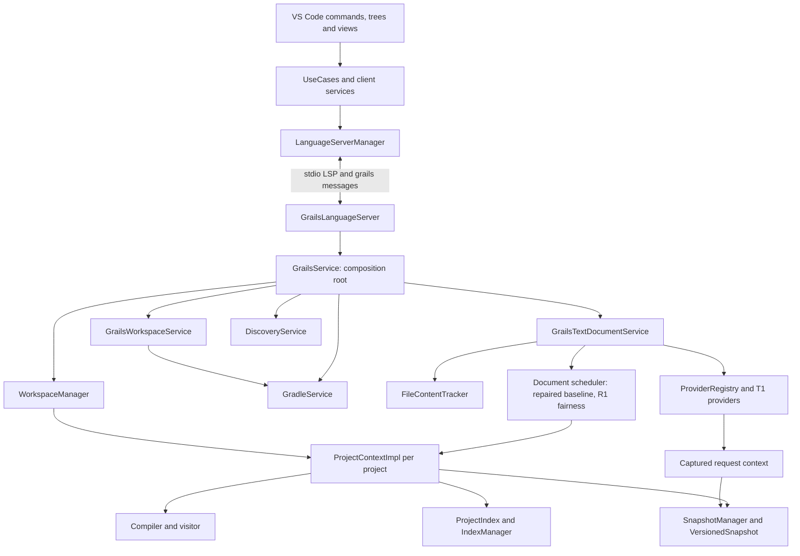

# System map and current implementation gaps

**Updated/source-inspected:** 2026-09-08. This map describes the current dirty source tree, not a verified release. Runtime evidence and unfinished work are in the [handoff](../implementation-handoff.md). Start delivery through [agent execution](../agent-execution.md); required behavior is in [invariants](../invariants.md).

## Current components

The diagram shows logical collaboration, not complete constructor signatures. GrailsService implements ProviderContext; ProjectContextImpl implements ProjectContext/CompilationContext. Providers are retrieved through ProviderRegistry. See current source rather than restoring an old `(service, service, service)` constructor pattern.

## What happens during startup and editing?

| Path | Current implementation evidence | Required/unfinished work |
|---|---|---|
| Client launch | Production stdio default, configured Java/stable JAR selection, early project notification handlers, deterministic package bundling | Baseline verified in R0-03 and R0-04. Multi-platform distribution matrix owned by R5-05 |
| Initialize/discovery | Prompt capability return on initialize; async discovery on initialized; root generations discard late results; longest prefix routing; still-open buffer replay; build-watch debounce | Baseline verified in R0-02. Multi-project classpath isolation and Gradle model edge resolution owned by R2-01/R2-03 |
| Open/change | FileContentTracker updates buffer; nonblocking document scheduler coalesces rapid edits; copied buffer immutability; blocked worker ordering | Baseline verified in R0-01. R1-01/R1-02 verify admission limits, cross-root fairness, revision ordering and stale rejection |
| Compile/publication | ProjectContextImpl uses project write lock, compiler/visitor/index work and SnapshotManager commit | Coherent read visibility and stale guards remain R1-02/R1-04 evidence requirements |
| Provider read | BaseProvider creates request context/captures active snapshot; legacy live access remains in the surrounding pipeline | Capturing a record does not prove nested AST immutability or protect asynchronous work |
| Dependency refresh | Gradle async support exists; project metadata updated in success path | R2-02 must align compiler/discovery/index with the new dependency revision |
| Cross-project lookup | Context registry exists, but compiler aggregates dependencies; URI fallback/guessed project edges remain | R0-02/R2-01/R2-03 must establish routing and actual dependency visibility |
| Hibernation | Live compiler/visitor cleared; active/LKG snapshots and discovery loader references may remain | R1-04 must prove coherent lease/release semantics and nonblocking routing |

The source contains GSP conversion and many language providers. Complete embedded HTML/CSS/JS behavior, dependency-backed configuration support, shared typed agent operations and full release compatibility remain roadmap work. Do not infer product completeness from registration or class presence.

## Ownership and read boundaries

| Owner | Writes | Readers/boundary |
|---|---|---|
| ServiceContainer | Client service wiring/lifecycle | Injected services and UseCases; no service-locator access from services |
| LanguageServerManager | LSP process/client lifecycle | Client UI/services |
| GrailsService | Server wiring, shared configuration/cancellation/health coordination | ProviderContext and owning collaborators |
| WorkspaceManager | Registered projects, root lifecycle, access/eviction coordination | URI routing must remain cheap; full isolation not yet proven |
| ProjectContextImpl | Scoped compiler/visitor/index publication, lifecycle, dependency revision | Providers consume a coherent captured view; never mutate compiler state |
| SnapshotManager | Active/LKG/history lineage | Request capture/recovery under bounded retention contract |
| FileContentTracker | Open buffers and tracked dependencies via owned write methods | Read inputs are versioned and copied before background work |
| GrailsTextDocumentService | Pending input work and scheduler lifetime | Delegates compilation to selected project owner |
| GradleService/sync owner | Connection and build-model work | Candidate results transferred to project owner after completion |
| DiscoveryService | Declaration extraction/caches | Scoped membership and loader release need R1/R2 repair |

Full ownership and stable identities live in [invariants](../invariants.md). A class owning a field does not prove that all callers respect its boundary.

## Provider tiers

T1 extends BaseProvider, receives context interfaces from the registry, captures request state, handles cancellation and records health. T2 is a pure static utility with explicit inputs and no retained mutable state. T3 receives only the dependencies required for its own concern/lifecycle. Value/context objects carry request-scoped input; they are not a loophole for providers to write shared state.

## High-risk source paths

- [ProjectContextImpl](../../server/src/main/groovy/kingsk/grails/lsp/context/ProjectContextImpl.groovy): property dispatch, locks, generation publication, close, activation and hibernation.
- [GrailsTextDocumentService](../../server/src/main/groovy/kingsk/grails/lsp/services/GrailsTextDocumentService.groovy): callback responsiveness, queue bounds, future lifetime and diagnostic ordering.
- [BaseProvider](../../server/src/main/groovy/kingsk/grails/lsp/providers/document/BaseProvider.groovy): request capture and current versus retained state.
- [GrailsASTVisitor](../../server/src/main/groovy/kingsk/grails/lsp/core/visitor/GrailsASTVisitor.groovy): copied maps retain AST object identities; audit nested mutation.
- [WorkspaceManager](../../server/src/main/groovy/kingsk/grails/lsp/services/WorkspaceManager.groovy): root routing/default fallback, guessed edges and synchronous LRU path.
- [GrailsCompiler](../../server/src/main/groovy/kingsk/grails/lsp/core/compiler/GrailsCompiler.groovy): workspace classpath aggregation and discovery registration.
- [DiscoveryService](../../server/src/main/groovy/kingsk/grails/lsp/services/DiscoveryService.groovy): fallback inventories, asynchronous scan publication and static classloader retention.

Read the relevant task card/spec and existing tests before changing these paths. [Code review](../skills/code-review.md) and [change triggers](change-triggers.md) apply; source-backed findings require appropriate runtime tests before claiming a fix.

## Documentation navigation

[Execution guide](../agent-execution.md) -> selected [task card](../execution/task-specifications.md) -> [invariants](../invariants.md), [failure modes](../failure-modes.md), [ADRs](../adr/decisions.md) -> applicable [server](../../server/RULES.md)/[client](../../client/RULES.md) rules and source. The [architecture overview](../architecture.md) supplies component boundaries. The graph report and phase plans are historical discovery aids, not authorities for current status or delivery order.
