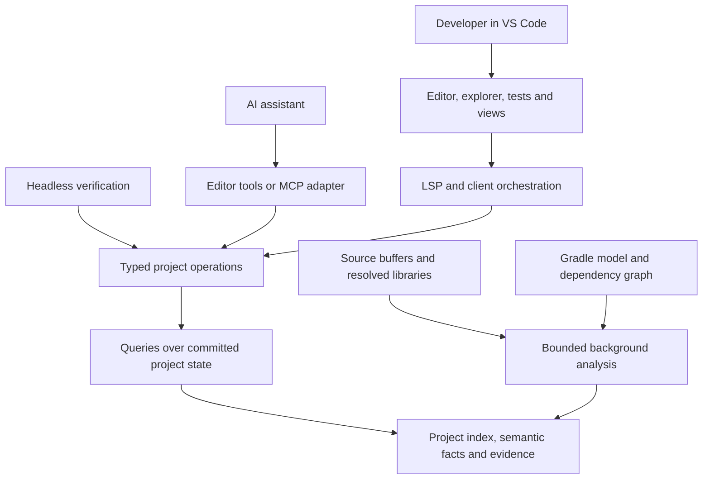

# Groovy and Grails IDE: product strategy and complete roadmap

**Owner:** project maintainer. **Updated:** 2026-09-08. **Status:** proposed product direction with an agreed first compatibility target of Grails 7+ and Groovy 4.

This is the primary document for product scope, priorities and release acceptance. It defines the intended finished product, not the current implementation. **Agents continuing delivery: follow the [execution guide](agent-execution.md) and run `node scripts/roadmap.js next`.** The [task queue](execution/task-queue.json) owns task status/dependencies, [acceptance cards](execution/task-specifications.md) define completion evidence, and the [implementation handoff](implementation-handoff.md) records unresolved server failures. Existing component rules and invariants govern implementation; architecture changes require evidence and the ADR process.

Start with the [finished 1.0 experience](#2-what-the-finished-10-product-looks-like), [delivery roadmap](#7-delivery-roadmap), [acceptance scorecard](#8-acceptance-scorecard-and-evaluation), or [limited-session workflow](#10-delivering-within-limited-sessions).

## 1. The product in one sentence

Build a responsive Groovy/Grails IDE and project analysis engine that tells developers and AI agents what exists in their actual project, how framework behavior connects, and whether a proposed change survives concrete checks.

The extension's central value is **reliable project knowledge and verification**. Completion, navigation, diagrams and agent tools are different ways to use that knowledge.

### The opportunity in the AI era

A stronger model can generate better code, inspect dependencies and run compilers itself. We should assume those abilities continue improving. The product must earn its place by making repeated project queries faster, more precise and easier to verify than rebuilding that understanding for every task.

The strategic hypothesis is that persistent, incremental, framework-aware tooling will remain useful as code generation improves. This is a hypothesis to test with developers and agent evaluations, not a guarantee against obsolescence.

| User need | Product contribution | How to prove the value |
|---|---|---|
| Use the APIs installed in this project | Resolve declarations, framework capabilities and dependency origins | Fewer invented or wrong-version API calls in a fixed task set |
| Understand Grails behavior spread across files | Connect routes, actions, services, domain entities, views and configuration | Less time and fewer file reads to answer a concrete question |
| Change code without breaking unrelated behavior | Explain affected symbols and relationships; preview edits | Correct impact results and fewer incorrect edits |
| Verify generated code | Report diagnostics, compilation/test outcomes and unresolved assumptions | More accepted changes passing independent tests |
| Work while indexing or syncing | Serve usable committed results; isolate heavy background work | Measured query latency during blocked Gradle and edit storms |
| Work without a model or network | Keep deterministic IDE features local | Offline editing/navigation on already resolved dependencies |

VS Code explicitly supports domain-specific language-model tools and external MCP tools. This provides a practical integration path alongside existing AI assistants. It does not require building a competing chat application. See [VS Code AI extensibility](https://code.visualstudio.com/api/extension-guides/ai/ai-extensibility-overview).

### Who the first release serves

Primary users are developers maintaining Grails applications, including people unfamiliar with a project's conventions. Secondary users are developers supervising AI-generated changes. Agents are API consumers of the same engine.

Start with small teams and individual maintainers using Grails 7/Groovy 4. Large enterprise portfolios, Grails 2-era migrations, remote hosted analysis and other JVM frameworks are expansion opportunities after evidence of demand.

## 2. What the finished 1.0 product looks like

“Finished” means the following workflows work on a declared, tested matrix. It does not mean every possible plugin or runtime metaprogram is statically understood.

### Open and understand a project

A developer installs one VSIX, selects Java if needed and opens a Grails project. The extension detects resolved Grails/Groovy/JDK/Gradle versions, source sets, plugins and dependencies. It shows discovery progress, degraded capabilities and actionable errors. The editor stays usable while analysis progresses.

The project view exposes controllers, services, domains, interceptors, TagLibs, views, configuration, tests, assets and nested source sets. Selecting an artifact reveals relevant relationships and actions. Names and locations come from the project model rather than a fixed template-only hierarchy.

### Edit and navigate with framework context

Completion and hover explain method signatures and their source. Definition, references and rename agree on the symbol they resolve. GORM finders use the actual domain properties and detected framework behavior. Closure delegates, traits, extension modules and Grails-injected behavior are handled where supported; uncertain results are labeled.

GSP editing combines Grails semantics with HTML, CSS, JavaScript and Groovy expression support. YAML, JSON and properties use applicable schemas and project configuration metadata. Navigation connects a route to its action, service, domain operation and template when evidence supports those edges.

### Run, debug and verify a change

Run/debug/test commands target the selected project and environment. Tests appear in VS Code's testing UI, diagnostics lead to source locations, and logs are easy to filter. Refactors show a preview and revalidate document versions before applying edits. A failed check has a clear recovery path.

Verification distinguishes static diagnostics, successful compilation and executed tests. A green diagnostic list is not presented as proof that application behavior is correct. Test results identify their scope; “affected tests” is not a guarantee of complete coverage.

### Use the project through an agent

An agent can discover available capabilities, query project APIs, inspect Grails relationships, obtain diagnostics and request a refactor preview. It receives bounded structured results with evidence locations, freshness and unresolved items. Explicit operations can run checks through existing tooling.

The developer sees which project and revision the agent used, what changed, and what passed. Agents and humans share analysis results; there is no separate AI-only symbol database that silently disagrees with the IDE.

### Maintain a project over time

Dependency changes invalidate only affected derived data where feasible. Previously usable analysis remains available during a failed sync. Later upgrade-assistance releases compare observed API/configuration changes and suggest checks, with evidence. Older or newer framework versions become supported only after their compiler/runtime combinations pass the compatibility suite.

## 3. Product principles and boundaries

1. **Project-resolved framework information is authoritative.** Do not require a patched Grails distribution or ship copied API inventories as the normal source of truth.
2. **Every answer has a scope.** Identify project, dependency state, document/index revision, resolution method and limitations.
3. **Responsiveness is a feature requirement.** Heavy work must not run in notification handlers or monopolize editor-facing resources.
4. **The IDE works without AI.** Models enhance workflows; core language intelligence must not require a subscription or remote service.
5. **One analysis engine, several interfaces.** Reuse it through LSP, UI, editor tools and eventually MCP/headless operations.
6. **Choose measured efficiency.** Evaluate CPU, allocations, retained heap and disk together. Avoid abstraction growth without a demonstrated workload.
7. **Ship narrow complete workflows.** A small reliable route-to-action navigation feature is more valuable than many registered but unvalidated providers.
8. **Uncertainty is visible.** Derived or heuristic behavior never becomes a claimed runtime fact merely because an agent requested it.

### What automatic compatibility means

The extension automatically detects and re-indexes supported project dependencies. It does not rewrite its own implementation or guarantee knowledge of future syntax and framework semantics.

Separate three compatibility problems:

| Layer | Discovery approach | When extension work is still needed |
|---|---|---|
| Library declarations | Sources, class metadata, generic signatures and annotations | Changed binary formats, unsupported signatures or missing metadata |
| Framework conventions | Capability adapters backed by actual artifacts and fixtures | New conventions, changed injection rules or dynamic behavior |
| Groovy compiler/runtime | Explicitly supported compiler integration | New syntax, AST interfaces, transforms or incompatible runtime versions |

Grails 7 introduced Java 17+, Groovy 4 and substantial Spring/Jakarta changes. This supports the chosen narrow starting target. See the [Apache Grails 7 announcement](https://news.apache.org/foundation/entry/the-apache-software-foundation-announces-apache-grails-7-0-0). Groovy supports [runtime and compile-time metaprogramming](https://groovy-lang.org/metaprogramming.html); bytecode inspection or reflection alone cannot promise to recover all application behavior.

Do not execute an application just to answer ordinary completion queries. Optional runtime observations must be explicit and associated with the run/environment that produced them. Compilation can execute transforms, so analysis that runs project code belongs behind the editor's workspace-trust boundary.

### Deliberately outside 1.0

Training a proprietary completion model; a mandatory cloud service; a new general-purpose chat UI; a custom Java debugger; a plugin marketplace inside the extension; support for every historic Grails release; automatic production deployment; and a generic knowledge graph unrelated to concrete IDE queries.

Reuse capable editor/build infrastructure. Static language grammar keywords may be fixed; the prohibition on hardcoded framework APIs does not prohibit normal grammars or syntax definitions.

## 4. Architecture direction

Keep the existing TypeScript client and JVM language server. This is an evolution of the repository, not a rewrite.



This diagram is the intended architecture. MCP, general headless operations and a complete semantic-fact layer are not implemented today.

### Analysis and discovery

Use Gradle's model to identify source sets, output directories, dependencies and explicit project edges. Resolve each project's classpath independently. The [Gradle Tooling API](https://docs.gradle.org/current/userguide/tooling_api.html) supports model access and cancellation, but connection ownership, timeout handling and stale-result rejection remain our responsibilities.

Prefer declaration extraction from sources/bytecode. Add capability adapters for framework behavior not directly represented there. Each adapter declares its inputs, supported capabilities, invalidation triggers and fixture tests. Capability detection comes before version-string branching; explicit version guards remain appropriate when behavior actually differs.

Build semantic facts for specific queries: controller action ownership, route mapping, service injection, domain relationships, template usage and configuration references. Include evidence and resolution kind on each edge. Dynamic edges can be incomplete; graph visualizations must preserve that distinction.

### Concurrency and lifecycle

Maintain one owner for each project's compiler/index publication, wired from `GrailsService`. Coalesce document edits by normalized URI. Copy or capture immutable input revisions before asynchronous processing. Preserve ordering of incremental LSP edits, including multiple changes within a notification.

Separate quick reads from Gradle, scanning and compilation. Bound active workers and queued revisions. Protect the whole write-and-publish transaction, not just the compiler call. Avoid publishing after close/removal/shutdown or after a newer revision supersedes the result. A read can return committed older information with a freshness label; it must not block on a full build.

Do not solve partial visibility by copying entire ASTs blindly. Establish actual ownership and reader reachability, then select generation isolation or extracted immutable query data with regression evidence. The current snapshot classes do not themselves prove deep AST immutability.

### Data structures and storage

| Workload | Initial design candidate | Validation |
|---|---|---|
| Exact symbol lookup | Project-scoped hash maps | Lookup latency and retained bytes per symbol |
| Prefix completion | Sorted compact names with binary search and result caps | Compare current lookup with a trie only if measurements justify it |
| Dependency impact | Adjacency lists and visited-set traversal | Explicit Gradle edges; proportional work over affected vertices/edges |
| Edit scheduling | Latest revision keyed by URI, bounded workers | A fixed set of open files does not accumulate work per keystroke |
| JAR metadata | Shared content-addressed records; separate project membership | Same-path content change invalidates; different projects cannot leak APIs |
| Documentation | Lazy extraction and bounded LRU | No bulk source/Javadoc download during activation |
| Disk persistence | Versioned compact records with atomic publication | Corrupt/old cache falls back to rebuild, not incorrect answers |
| Language regions | Incremental region map with explicit UTF-16 positions | Correct edits and diagnostics around mixed-language boundaries |

A dependency's coordinates and filename are insufficient cache identities when local artifacts can be rebuilt in place. Use content fingerprints when needed; do not re-hash every JAR on every keystroke. Avoid duplicating dependency JARs in extension storage. Share extracted immutable metadata where safe, while retaining project-specific resolution.

Record actual disk and memory budgets before advertising limits. Hibernation tests must check retained references and classloader release, not only enum transitions or fields becoming null.

## 5. IDE and visual experience

The visual goal is a coherent, advanced workspace that helps users understand their application. Visual novelty is not an acceptance criterion by itself.

| Surface | Job | Behavior |
|---|---|---|
| Project explorer | Navigate artifacts and nested source sets | Lazy expansion, search, selected-project context and direct file opening |
| Editor | Fast everyday decisions | Precise completion/hover/navigation, concise diagnostics, refactor preview |
| Project overview | Explain readiness and provide useful actions | Detected runtime, sync status, test summary and recent problems from real data |
| Routes and relationships | Follow framework connections | Select a route/entity; inspect evidence-backed edges and open source |
| Dependency view | Explain API origins and upgrade differences | Search/filter graph; show project scope and dependency versions |
| Change review | Assess a human or agent proposal | File edits, affected facts, performed checks and unresolved assumptions |
| Status and output | Explain background work and recovery | Discreet progress; detailed logs on demand; cancellation where supported |

Use VS Code theme tokens, readable typography, clear spacing and keyboard navigation. Support high contrast, screen readers and reduced motion. Preserve view state without retaining hidden heavyweight webviews. Large graphs need bounded visible neighborhoods, not thousands of animated nodes.

Prefer native editor, tree, testing and task interfaces for standard workflows. Use webviews for relationships and comparisons that benefit from visualization. The same actions must be reachable without using a graph or mouse.

For embedded languages, evaluate VS Code's documented [language services and request-forwarding approaches](https://code.visualstudio.com/api/language-extensions/embedded-languages). Keep GSP parsing/source mapping authoritative, and reuse HTML/CSS/JavaScript providers where compatible. Test malformed templates, nested expressions, virtual-document edits, diagnostics and additional text edits; highlighting alone is insufficient.

## 6. Agent workflows and the proposed tool contract

Start with editor-integrated read tools after the analysis foundation is usable. Add MCP portability after the operations stabilize. An external agent must never accidentally receive a different project's context or assume disk content includes unsaved editor buffers.

The following names describe proposed operations, not existing commands or APIs:

| Operation | Returns | First release |
|---|---|---|
| `project.capabilities` | Runtime, source sets, supported analysis and current readiness | R3 |
| `symbols.search` | Bounded symbols with locations and origins | R3 |
| `symbols.explain` | Signature, declaration source, available framework evidence | R3 |
| `project.diagnostics` | Diagnostics with revision, scope and freshness | R3 |
| `grails.relationships` | Routes/actions/services/domains/views with evidence per edge | R4 |
| `changes.impact` | Known affected symbols/config/templates and explicit unknowns | R5 |
| `refactor.preview` | Proposed version-checked edits and unresolved matches | R5 |
| `checks.run` | Explicit compile/test result, scope, duration and output reference | R5 |
| `dependencies.compare` | Observed API/configuration deltas between supported states | R6 |

Reads are local and do not require a model call. Mutation and task execution follow the host's authorization/trust model; the tool itself validates project scope, arguments and document preconditions. Resource paths must not become arbitrary shell execution arguments.

### Example query result

The envelope below is illustrative. Final schemas belong in the shared protocol after an ADR and implementation review.

```json
{
  "schemaVersion": 1,
  "projectUri": "file:///example/shop",
  "indexRevision": 42,
  "documents": [{ "uri": "file:///example/shop/grails-app/domain/Book.groovy", "version": 8 }],
  "freshness": "current",
  "completeness": "partial",
  "resolution": "framework-derived",
  "items": [{ "name": "findByTitle", "origin": "GORM capability adapter" }],
  "evidence": [{ "uri": "file:///example/shop/grails-app/domain/Book.groovy", "symbol": "Book.title" }],
  "limitations": ["Runtime metaclass changes were not observed"],
  "nextCursor": null
}
```

Define resolution kinds such as declaration-backed, framework-derived, runtime-observed, heuristic and unresolved. Do not substitute invented numeric confidence scores for evidence. Freshness and completeness are independent: a result can be both stale and partial. Missing/partial data must differ from an authoritative empty result. A freshness token expires when its relevant project/dependency/document state changes. The [agent operation specification](specs/agent-tools.md) defines the required semantics.

Return focused results with caps, filters, pagination and links to further evidence. Avoid sending the complete repository or dependency inventory on every call. The [MCP tools specification](https://modelcontextprotocol.io/specification/2025-11-25/server/tools) provides tool schemas and structured results; the project must still define its own semantic/freshness contract. Protocol annotations are descriptive metadata, not authorization enforcement.

For headless sessions, identify whether analysis uses a disk checkout, a supplied revision or an explicit overlay. Do not pretend to see a running editor's unsaved state. Prefer reusing a local engine session when available, but do not make CI depend on an editor process.

### Three demonstrations that would establish useful agent support

1. **Wrong-version API correction:** an agent proposes a method absent from the installed dependency. A query returns the declaration evidence and supported alternatives. The resulting patch passes a fixture test.
2. **Cross-layer change:** a developer changes a controller action/domain property. The tool identifies known route/template/GORM references, previews changes and names unresolved dynamic usages. Independent tests verify the edited workflow.
3. **Focused verification:** an agent asks which checks are relevant to an edit, runs an explicitly scoped check and receives a reproducible result. A separate acceptance suite detects regressions that a narrow test selection would miss.

The product helps discover and verify facts. It does not claim that a semantic query, a compile pass or an agent's explanation proves business correctness.

## 7. Delivery roadmap

Use release gates rather than speculative dates. The repository already has substantial implementation; each phase starts by auditing and reusing it. Work on a phase ends when its acceptance evidence is recorded, not when its files or provider classes exist.

```text
R0 recover build/startup --> R1 responsive foundation --> R2 framework correctness
                                                           |
                                                           +--> R3 useful agent reads
                                                           |
                                                           +--> R4 complete daily IDE
                                                                      |
                                                    R3 + R4 --> R5 verified changes / 1.0
                                                                      |
                                                               R6 compatibility growth
```

R3 and R4 can overlap after R2's required query foundations. Do not delay the first useful agent tools until every UI or refactoring feature is finished.

### R0 — Recover the interrupted implementation and establish startup

**Deliverable:** a buildable development VSIX and a repeatable startup test. **Current state:** in progress; see the handoff.

| ID | Task | Completion evidence |
|---|---|---|
| R0-01 | Repair interrupted document scheduling/publication changes | Targeted regressions pass; test failures and root causes documented |
| R0-02 | Implement initialized-time project discovery and folder lifecycle | Empty/fresh workspace, slow discovery, removal during discovery and reopening tests |
| R0-03 | Complete bundled stdio launch and custom protocol wiring | Real JAR initializes, reports projects, handles a document and exits cleanly |
| R0-04 | Validate deterministic build/copy/package path | Intended JAR inside VSIX; fresh install uses configured Java |
| R0-05 | Reconcile status, architecture and failure documents | No claim of full isolation/snapshot safety without evidence; baseline saved |

**Gate:** relevant tests and client compile/types/lint pass; packaged-editor startup is observed. Existing failing smoke reproduction is not a passing release test.

### R1 — Make background analysis predictable

**Deliverable:** an editing session that remains usable through typing bursts, sync failures and lifecycle changes. **Depends on:** R0.

| ID | Task | Completion evidence |
|---|---|---|
| R1-01 | Coalesce pending revisions and bound worker concurrency | Blocked compiler + edit storm; final revision processed; pending count bounded |
| R1-02 | Preserve version/order and reject stale publication | Multi-change notifications, concurrent edit/close/reopen, cancellation and shutdown tests |
| R1-03 | Bound Gradle synchronization and retain usable state | Timeout/cancel/failure tests; available queries remain responsive |
| R1-04 | Validate publication and lifecycle ownership | No partial index/AST generation exposure in deterministic concurrency tests |
| R1-05 | Establish performance and resource baselines | Reproducible latency/heap/disk artifacts with fixture and hardware metadata |

**Gate:** no editor notification waits for compilation or Gradle; no stale committed result masquerades as current; no continuing retained-memory growth across repeated settled sessions. Release a technical preview only within its tested scope.

### R2 — Make project-derived Grails intelligence correct

**Deliverable:** dependable answers about the project's own installed APIs. **Depends on:** relevant R1 state/freshness guarantees.

| ID | Task | Completion evidence |
|---|---|---|
| R2-01 | Isolate classpaths and source sets by project | Two projects using different dependency versions never exchange completions |
| R2-02 | Refresh compiler/discovery/index after dependency changes | Added/removed methods appear/disappear without restart; failed sync retains old state |
| R2-03 | Replace guessed project edges with Gradle graph edges | Renamed projects, cycles, composite builds and similarly prefixed paths tested |
| R2-04 | Verify declarations, traits, extension modules and API origins | Fixture answers match resolved source/bytecode evidence |
| R2-05 | Add or repair targeted Grails capability adapters | GORM, injection, delegates and plugin cases covered by real artifacts |
| R2-06 | Establish a compatibility matrix and dependency-change fixtures | Named Grails/Groovy/JDK/Gradle combinations; tested/experimental/unsupported labels |

**Gate:** demonstrate dependency upgrade/downgrade in one workspace, correct suggestions afterward, and no change in an unrelated project. Ship a useful language-tooling alpha after this gate.

### R3 — Deliver the first agent integration

**Deliverable:** small, dependable read tools for actual developer tasks. **Depends on:** R2 symbol/evidence queries; no dependency on finishing all R4 UI.

| ID | Task | Completion evidence |
|---|---|---|
| R3-01 | Define bounded typed queries and freshness/error envelopes | Schema tests; current/stale/partial/unavailable states distinguishable |
| R3-02 | Expose capabilities, symbol search/explanation and diagnostics in VS Code | Agent tool results agree with editor queries for the same revision |
| R3-03 | Evaluate benefit against agent + search + Gradle alone | Fixed task set, acceptance tests, time and query/output-volume comparison |
| R3-04 | Add MCP adapter after contracts stabilize | Same operations exercised by a second client; no duplicate project index |

**Gate:** a developer can use an assistant to resolve a real Grails API question using returned evidence, and an automated evaluator verifies the answer. At least one measured improvement must justify keeping each tool.

### R4 — Complete daily IDE workflows and mixed-language editing

**Deliverable:** a practical IDE beta. **Depends on:** R2, with individual features using only their required foundations.

| ID | Task | Completion evidence |
|---|---|---|
| R4-01 | Align completion/hover/definition/reference identity | Cross-feature tests, overloads, local variables and unsaved edits |
| R4-02 | Model routes, injection, entities, TagLibs, views and configuration | Evidence-backed queries; incomplete dynamic behavior labeled |
| R4-03 | Implement GSP language regions and routing | HTML/CSS/JS/Groovy editing, malformed syntax, UTF-16 and additional-edit tests |
| R4-04 | Integrate YAML/JSON/properties schema metadata | Nested settings, dependency-provided metadata, profiles and i18n cases |
| R4-05 | Finish source-set/nested-artifact explorer behavior | Multi-module, generated sources, assets and large lazy trees |
| R4-06 | Validate run/debug/test and output workflows | Selected project/environment, task cancellation and actionable failure recovery |
| R4-07 | Integrate overview/relationship/dependency views | Real state only; keyboard, screen-reader and large-data acceptance checks |

**Gate:** complete a supported application's route-to-view development task, debug it and run tests in a fresh VSIX installation. No essential step depends on opening an internal debug view.

### R5 — Verify changes and ship 1.0

**Deliverable:** reviewed changes and reproducible verification for humans and agents. **Depends on:** R3 and relevant R4 semantic/identity coverage.

| ID | Task | Completion evidence |
|---|---|---|
| R5-01 | Implement conservative impact analysis | Known true/false relationships and explicit unknowns evaluated on held-out fixtures |
| R5-02 | Deliver rename previews with version preconditions | Cross-file edits, ambiguity rejection, changed buffers and partial-failure recovery |
| R5-03 | Add task-scoped compile/test operations and result records | Correct workspace, bounded execution, cancellation and reproducible artifacts |
| R5-04 | Present human/agent change reviews | Source evidence, edits, checks and unchecked assumptions visible together |
| R5-05 | Run full release matrix and user acceptance | Cross-platform fresh install, stability session, accessibility and migration notes |

**Gate:** the 1.0 definition in section 2 and scorecard in section 8 pass. Rename is the required initial refactoring; move/safe-delete follow only where identity and impact evidence support them.

### R6 — Grow compatibility and deepen useful analysis

**Deliverable:** incremental supported expansion after 1.0, chosen from measured demand.

| ID | Candidate | Admission criterion |
|---|---|---|
| R6-01 | Selected older/newer Grails and Groovy versions | Requested real projects, isolated compiler strategy and added matrix fixtures |
| R6-02 | Dependency/API/configuration upgrade comparisons | Evidence of saved migration work; differences verified against both artifacts |
| R6-03 | Plugin-supplied capability/schema adapters | Stable adapter contracts and contributor compatibility tests |
| R6-04 | Runtime observations and performance explanations | Explicit session/environment scope; proven benefit beyond static analysis |
| R6-05 | Headless CI checks and team conventions | Reproducible checkout/overlay semantics and demand from active users |
| R6-06 | Richer refactoring and test-impact selection | Measured precision; independent full-suite validation and clear limitations |

Do not broaden into every JVM framework or launch hosted services just because the engine could be reused. Require a concrete workflow, maintainable scope and usage evidence.

## 8. Acceptance scorecard and evaluation

These are initial targets to validate, not current measured results. Any change to a target needs a recorded reason. Report hardware, JDK, fixture sizes, sample count and cold/warm state.

| Dimension | Proposed gate |
|---|---|
| Notification responsiveness | p95 under 10 ms for ordinary source files; large documents measured separately |
| Warm completion/hover | p95 under 100 ms over a committed project on the reference fixture |
| Initialization | Capabilities returned without waiting for Gradle; JVM startup measured separately |
| Edit storm | At most one pending revision per URI plus bounded active work; newest revision eventually processed |
| Gradle blocked for 30 seconds | Available indexed reads continue; readiness correctly identifies stale/partial state |
| Memory | No sustained retained-growth trend after warmup and repeated edit/close cycles |
| Storage | Measured by cache category; explicit configured budget and tested eviction |
| Correctness | Required fixture expectations pass; heuristic coverage and false positives reported separately |
| Agent utility | Improvement on accepted-task success, elapsed time or query/output cost without correctness regression |
| Packaging | Fresh VSIX install exercised on Windows, Linux and macOS |
| UX | Core workflows usable by keyboard; themes/high contrast/reduced motion respected |

Build small, medium and large fixtures plus a mixed-version multi-project fixture. Include GSP/configuration files, real resolved Grails dependencies, a corrupted cache, a blocked sync, an edit storm and removal during initialization. Mocks test ordering/failures; they cannot replace actual transport and artifact tests.

### Evaluate the AI value instead of assuming it

Maintain a versioned benchmark of roughly 20–30 representative tasks initially: locate a route, explain an injected API, repair a wrong-version method, rename a domain property used in a view, diagnose a config error, and verify an upgrade-sensitive change.

Compare the same model/settings with (a) ordinary repository search/build access and (b) those facilities plus project tools. Keep an independent acceptance suite that the agent does not redefine. Record accepted outcomes, incorrect changes, elapsed time, tool calls, output/token volume and verification scope. Repeat non-deterministic tasks and report variability. Include query-only tasks and complete changes.

Do not report retrieval accuracy as complete-task success, or improved latency as improved correctness. If a stronger model makes a tool redundant, simplify or retire that tool and retain the useful analysis capability underneath.

## 9. How the project remains relevant

No roadmap can promise permanent relevance. The defensible investment is accumulated, tested framework semantics and efficient project state, not attachment to one model, prompt or editor panel.

Review direction monthly during active development, and after a material ecosystem change. Ask:

- Which developer/agent workflow was completed faster or more correctly because of the extension?
- Which results had insufficient evidence or stale state?
- Which existing editor/build/agent capability now makes one of our features redundant?
- Which new Grails/Groovy release changes actual compiler or convention behavior?
- What costs the most CPU, heap, disk, maintenance time and user attention?

Preserve model independence and portable typed operations. Integrate new clients through small adapters. Avoid daily redesign to follow model launch announcements. New models should be able to use improved project queries immediately without an engine rewrite.

Adoption should start with a few real maintainers completing concrete workflows and reporting failures. Five design partners is a reasonable initial recruitment target, not statistical validation. Expand the fixture corpus from reproducible real issues, with permission to share source where needed. Prefer retention and repeated successful tasks over download counts or a long feature list.

Core deterministic tooling should be usable locally without a mandatory hosted account. If commercial offerings are considered later, validate demand for team policy, managed compatibility testing or hosted workflows first; do not make speculative pricing part of the technical roadmap.

## 10. Delivering within limited sessions

At the 2026-09-08 documentation checkpoint, the next coding task is **R0-01**. Use `node scripts/roadmap.js next` for the current answer; complete its acceptance card before selecting another task. Existing unfinished work must be repaired before another architectural expansion. Follow the [execution guide](agent-execution.md), including how to resume after a usage limit and requeue dependents after a regression.

Every task handoff should contain:

- Task ID, user-visible outcome and dependencies.
- Exact files and relevant existing tests.
- Reproduction and acceptance commands.
- Latest observed result, including failures and environment constraints.
- Required status/KB updates and one explicit next action.

Prefer one verifiable slice within a task per session. Run affected tests first, then required component checks. Do not repeat the full architecture audit each session. Update this roadmap when scope/priority changes; record acceptance state in the queue, evidence in its task records and implementation capability summaries in component STATUS. The initial handoff is historical evidence after its tasks progress.

### Relationship to existing plans

| Existing document | How to use it now |
|---|---|
| [Architecture improvement plan](architecture-improvement-plan.md) | Technical history and candidate work; old completion labels are not release evidence |
| [Phase 3 plan](phase-plans/phase-3-plan.md) | Input to R0/R1/R2 lifecycle, sync and isolation tasks |
| [Phase 4 plan](phase-plans/phase-4-plan.md) | Input to build/documentation/maintenance tasks |
| [Phase 5 plan](phase-plans/phase-5-plan.md) | Candidate semantic/refactoring design for R2/R4/R5; revalidate before implementation |
| [Invariants](invariants.md) and [decisions](adr/decisions.md) | Current implementation constraints and accepted architecture decisions |
| [Implementation handoff](implementation-handoff.md) | Exact interrupted state, observed checks and next task |

Phase numbers in older architecture documents are not the R0–R6 product releases. This product roadmap supplies the delivery order; it does not silently approve changes to existing implementation contracts.
